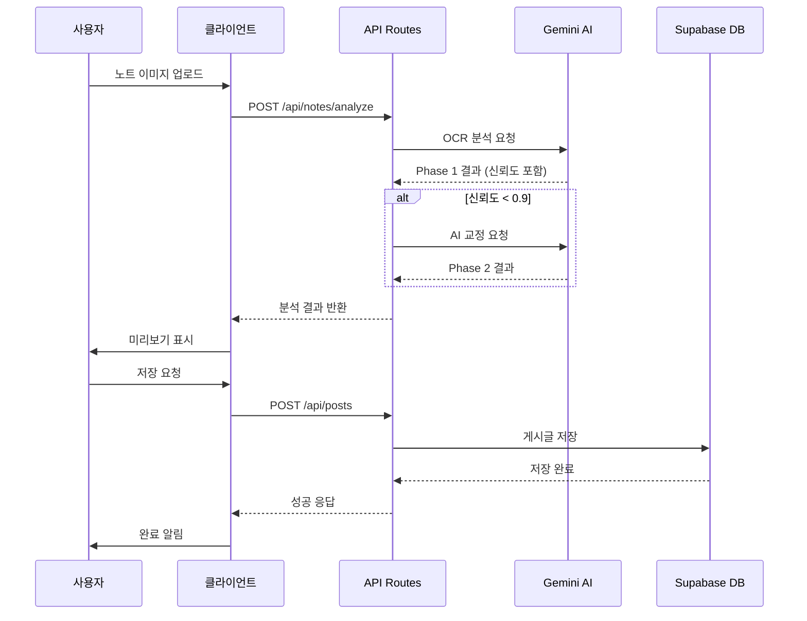

# 2. SW 설계와 방법론 (20점)

## 2.1 시스템 아키텍처

### 전체 시스템 구조도

```
┌─────────────────────────────────────────────────────────────────────────────┐
│                              클라이언트 (Browser)                           │
│  ┌─────────────────────────────────────────────────────────────────────┐   │
│  │                     Next.js 15 (React 18)                            │   │
│  │  ┌──────────┐  ┌──────────┐  ┌──────────┐  ┌──────────────────┐    │   │
│  │  │  Pages   │  │Components│  │ Contexts │  │     Hooks        │    │   │
│  │  │ (App     │  │(Timeline,│  │(AuthCtx) │  │ (useAuth, etc.)  │    │   │
│  │  │  Router) │  │ PostForm)│  │          │  │                  │    │   │
│  │  └──────────┘  └──────────┘  └──────────┘  └──────────────────┘    │   │
│  └─────────────────────────────────────────────────────────────────────┘   │
└─────────────────────────────────────────────────────────────────────────────┘
                                      │
                                      │ HTTP/HTTPS
                                      ▼
┌─────────────────────────────────────────────────────────────────────────────┐
│                           서버 (Next.js API Routes)                         │
│  ┌─────────────────────────────────────────────────────────────────────┐   │
│  │                         /api/*                                       │   │
│  │  ┌────────────┐  ┌────────────────┐  ┌──────────────────────────┐  │   │
│  │  │   /posts   │  │ /notes/analyze │  │  /knowledge/generate     │  │   │
│  │  │   /mypage  │  │ /schedule/     │  │  /comments               │  │   │
│  │  │   /auth    │  │    analyze     │  │  /interactions           │  │   │
│  │  └────────────┘  └────────────────┘  └──────────────────────────┘  │   │
│  └─────────────────────────────────────────────────────────────────────┘   │
└─────────────────────────────────────────────────────────────────────────────┘
            │                      │                         │
            ▼                      ▼                         ▼
┌───────────────────┐  ┌───────────────────┐  ┌───────────────────────────┐
│   Supabase Auth   │  │   Gemini API      │  │   Supabase Database       │
│   (인증 서비스)    │  │   (AI 분석)        │  │   (PostgreSQL + Storage)  │
│                   │  │                   │  │                           │
│  - Email/PW       │  │  - 2.5 Pro       │  │  - posts                  │
│  - Google OAuth   │  │  - 2.5 Flash     │  │  - profiles               │
│  - GitHub OAuth   │  │  - OCR 분석       │  │  - knowledge_cards        │
│  - Kakao OAuth    │  │  - 지식카드 생성   │  │  - schedules              │
└───────────────────┘  └───────────────────┘  └───────────────────────────┘
```

### 기술 스택 상세

| 계층 | 기술 | 버전 | 용도 |
|------|------|------|------|
| **Frontend** | Next.js | 15.0 | React 기반 풀스택 프레임워크 |
| | React | 18.3.1 | UI 컴포넌트 라이브러리 |
| | TypeScript | 5.4.5 | 타입 안전성 |
| | Tailwind CSS | 3.4.4 | 유틸리티 기반 CSS |
| **Backend** | Next.js API Routes | - | 서버리스 API 엔드포인트 |
| **Database** | Supabase (PostgreSQL) | - | 관계형 데이터베이스 |
| | Supabase Storage | - | 파일 저장소 (이미지) |
| **Auth** | Supabase Auth | 2.45.0 | 인증 및 세션 관리 |
| **AI** | Google Gemini | 0.21.0 | OCR, 지식카드 생성 |
| **Markdown** | react-markdown | 9.0.1 | 마크다운 렌더링 |
| | remark-gfm | 4.0.0 | GitHub Flavored Markdown |
| | remark-math | 6.0.0 | LaTeX 수식 파싱 |
| | rehype-katex | 7.0.1 | 수식 렌더링 |

---

## 2.2 SW 설계 및 분석의 체계성

### 디렉토리 구조

```
src/
├── app/                          # Next.js App Router
│   ├── page.tsx                  # 홈페이지 (/)
│   ├── layout.tsx                # 루트 레이아웃
│   ├── globals.css               # 전역 스타일
│   │
│   ├── api/                      # API 라우트 (백엔드)
│   │   ├── posts/
│   │   │   ├── route.ts          # GET, POST /api/posts
│   │   │   └── [id]/route.ts     # PATCH, DELETE /api/posts/:id
│   │   ├── notes/
│   │   │   └── analyze/route.ts  # POST /api/notes/analyze
│   │   ├── knowledge/
│   │   │   ├── generate/route.ts # POST /api/knowledge/generate
│   │   │   └── [id]/route.ts     # DELETE /api/knowledge/:id
│   │   ├── schedule/
│   │   │   └── analyze/route.ts  # POST /api/schedule/analyze
│   │   ├── mypage/route.ts       # GET, PUT /api/mypage
│   │   ├── comments/route.ts     # GET, POST /api/comments
│   │   └── auth/callback/route.ts # OAuth 콜백
│   │
│   ├── login/page.tsx            # 로그인 페이지
│   ├── signup/page.tsx           # 회원가입 페이지
│   ├── join/page.tsx             # 프로필 설정
│   ├── mypage/page.tsx           # 마이페이지
│   ├── write/page.tsx            # 새 게시글 작성
│   ├── post/[id]/page.tsx        # 게시글 상세
│   ├── profile/[id]/page.tsx     # 사용자 프로필
│   ├── board/[boardName]/page.tsx # 게시판별 목록
│   └── search/page.tsx           # 검색 결과
│
├── component/                    # React 컴포넌트
│   ├── StudyNoteUploadForm.tsx   # AI 노트 분석 폼 (핵심)
│   ├── ImageScheduleForm.tsx     # 시간표 분석 폼
│   ├── KnowledgeCards.tsx        # 지식카드 표시
│   ├── KnowledgeCardModal.tsx    # 지식카드 상세 모달
│   ├── Timeline.tsx              # 메인 타임라인
│   ├── PostList.tsx              # 게시글 목록
│   ├── PostItem.tsx              # 게시글 카드
│   ├── PostForm.tsx              # 게시글 작성 폼
│   ├── CommentSection.tsx        # 댓글 섹션
│   ├── ScheduleWidget.tsx        # 시간표 위젯
│   ├── AuthGuard.tsx             # 인증 보호
│   ├── SimpleHeader.tsx          # 상단 헤더
│   └── ...
│
├── contexts/                     # React Context
│   └── AuthContext.tsx           # 인증 상태 관리
│
├── lib/                          # 유틸리티
│   ├── supabaseBrowserClient.ts  # 클라이언트 Supabase
│   ├── supabaseClient.ts         # 서버 Supabase
│   └── knowledge_cards_schema.sql # DB 스키마
│
└── middleware.ts                 # Next.js 미들웨어
```

### 컴포넌트 설계 원칙

#### 1. 단일 책임 원칙 (SRP)

각 컴포넌트는 하나의 책임만 가집니다:

| 컴포넌트 | 책임 |
|----------|------|
| `StudyNoteUploadForm` | 이미지 업로드 → AI 분석 → 게시글 저장 |
| `Timeline` | 게시글 목록 표시 + 필터링 + 정렬 |
| `KnowledgeCards` | 지식카드 카로셀 표시 |
| `AuthGuard` | 인증 상태 확인 + 리다이렉트 |

#### 2. 컴포넌트 계층 구조

```
Layout (SimpleHeader + MainContent)
├── HomePage
│   ├── KnowledgeCards (추천 지식카드)
│   ├── ScheduleWidget (시간표)
│   └── Timeline (게시글 타임라인)
│       ├── TopicFilter
│       └── PostList
│           └── PostItem
├── WritePage
│   ├── PostForm (일반 게시글)
│   └── StudyNoteUploadForm (AI 노트)
└── PostDetailPage
    ├── PostContent
    ├── PostInteraction
    └── CommentSection
```

---

## 2.3 SW 적합성 및 방법론의 체계성

### Next.js App Router 패턴

#### 페이지 라우팅

```typescript
// 동적 라우팅 예시: src/app/post/[id]/page.tsx
export default async function PostDetailPage({
  params
}: {
  params: { id: string }
}) {
  const { id } = await params;
  // 게시글 데이터 로드...
}
```

#### API 라우트 패턴

```typescript
// src/app/api/posts/route.ts
export async function GET(request: Request) {
  // 게시글 목록 조회
}

export async function POST(request: Request) {
  // 게시글 생성
}
```

### 상태 관리 전략

#### Context API 활용

```typescript
// src/contexts/AuthContext.tsx
interface AuthContextType {
  user: User | null;
  isLoggedIn: boolean;
  isLoading: boolean;
  logout: () => Promise<void>;
  theme: 'light' | 'dark';
  toggleTheme: () => void;
}

export const AuthProvider = ({ children }) => {
  const [user, setUser] = useState<User | null>(null);

  useEffect(() => {
    // Supabase 인증 상태 구독
    const { data: { subscription } } =
      supabase.auth.onAuthStateChange((event, session) => {
        setUser(session?.user ?? null);
      });

    return () => subscription.unsubscribe();
  }, []);

  return (
    <AuthContext.Provider value={{ user, ... }}>
      {children}
    </AuthContext.Provider>
  );
};
```

#### 컴포넌트 로컬 상태

```typescript
// src/component/StudyNoteUploadForm.tsx
type Step = 'upload' | 'analyzing' | 'preview' | 'saving';

const StudyNoteUploadForm = () => {
  const [step, setStep] = useState<Step>('upload');
  const [images, setImages] = useState<ImageItem[]>([]);
  const [editedTitle, setEditedTitle] = useState('');
  // ...
};
```

---

## 2.4 라이브러리 사용 방법의 적절성

### AI 라이브러리: Google Generative AI

#### 모델 선택 기준

| 모델 | 사용 기능 | 선택 이유 |
|------|----------|----------|
| Gemini 2.5 Pro | OCR 분석, 시간표 분석 | 높은 정확도 필요 |
| Gemini 2.5 Flash | 지식카드 생성 | 빠른 응답 속도 우선 |

#### 구현 예시

```typescript
// src/app/api/notes/analyze/route.ts
import { GoogleGenerativeAI } from "@google/generative-ai";

const genAI = new GoogleGenerativeAI(process.env.GEMINI_API_KEY!);
const model = genAI.getGenerativeModel({
  model: "gemini-2.5-pro-preview-05-06"
});

// 멀티모달 분석 (이미지 + 텍스트)
const result = await model.generateContent([
  {
    inlineData: {
      mimeType: mimeType,
      data: base64Image,
    },
  },
  { text: systemPrompt },
]);
```

### 마크다운 라이브러리

#### 렌더링 파이프라인

```tsx
// 마크다운 + LaTeX 수식 지원
import ReactMarkdown from "react-markdown";
import remarkGfm from "remark-gfm";
import remarkMath from "remark-math";
import rehypeKatex from "rehype-katex";

<ReactMarkdown
  remarkPlugins={[remarkGfm, remarkMath]}
  rehypePlugins={[rehypeKatex]}
>
  {content}
</ReactMarkdown>
```

#### 지원되는 형식

| 형식 | 문법 | 예시 |
|------|------|------|
| 인라인 수식 | `$...$` | `$E = mc^2$` |
| 블록 수식 | `$$...$$` | `$$\frac{a}{b}$$` |
| 테이블 | GFM 테이블 | `\| a \| b \|` |
| 체크리스트 | `- [ ]` | `- [x] 완료` |
| 코드 블록 | ` ``` ` | Python, JS 등 |

### 인증 라이브러리: Supabase Auth

```typescript
// 소셜 로그인 구현
const { error } = await supabase.auth.signInWithOAuth({
  provider: 'google',  // 또는 'github', 'kakao'
  options: {
    redirectTo: `${origin}/auth/callback`,
  },
});

// 세션 확인
const { data: { user } } = await supabase.auth.getUser();
```

---

## 2.5 데이터나 리소스 사용 방법의 적절성

### 데이터베이스 스키마 (ERD)

```
┌──────────────────┐     ┌──────────────────┐     ┌──────────────────┐
│     profiles     │     │      posts       │     │ knowledge_cards  │
├──────────────────┤     ├──────────────────┤     ├──────────────────┤
│ id (UUID) PK     │◄────│ user_id (UUID)   │────►│ post_id (BIGINT) │
│ username         │     │ id (BIGINT) PK   │     │ id (BIGINT) PK   │
│ school_name      │     │ title            │     │ user_id (UUID)   │
│ major            │     │ content          │     │ title            │
│ double_major     │     │ board            │     │ summary          │
│ created_at       │     │ tag              │     │ category         │
└──────────────────┘     │ image_url        │     │ keywords[]       │
                         │ created_at       │     │ created_at       │
                         └──────────────────┘     └──────────────────┘
                                  │
                                  │ 1:N
                                  ▼
                         ┌──────────────────┐
                         │ post_hashtags    │     ┌──────────────────┐
                         ├──────────────────┤     │    hashtags      │
                         │ post_id          │────►├──────────────────┤
                         │ hashtag_id       │     │ id (BIGINT) PK   │
                         └──────────────────┘     │ name             │
                                                  │ count            │
                                                  └──────────────────┘
```

### Row Level Security (RLS)

```sql
-- knowledge_cards 테이블 RLS 정책
-- 모든 사용자가 읽기 가능
CREATE POLICY "Anyone can read" ON knowledge_cards
  FOR SELECT USING (true);

-- 인증된 사용자만 생성 가능
CREATE POLICY "Authenticated users can insert" ON knowledge_cards
  FOR INSERT WITH CHECK (auth.uid() IS NOT NULL);

-- 본인 카드만 삭제 가능
CREATE POLICY "Users can delete own cards" ON knowledge_cards
  FOR DELETE USING (auth.uid() = user_id);
```

### Storage 버킷 구조

```
post-images/                    # 게시글 이미지 버킷
└── {user_id}/                  # 사용자별 폴더
    └── {timestamp}-{id}.{ext}  # 이미지 파일
```

### API 요청/응답 형식

#### 표준 응답 형식

```typescript
// 성공 응답
{
  "success": true,
  "data": { ... },
  "message": "처리가 완료되었습니다."
}

// 에러 응답
{
  "success": false,
  "error": "에러 메시지",
  "code": "ERROR_CODE"
}
```

---

## 2.6 설계 다이어그램

### 컴포넌트 의존성 다이어그램

```mermaid
graph TD
    subgraph Pages
        Home[HomePage]
        Write[WritePage]
        PostDetail[PostDetailPage]
        MyPage[MyPagePage]
    end

    subgraph Components
        Timeline
        PostList
        PostItem
        StudyNoteUploadForm
        ImageScheduleForm
        KnowledgeCards
        CommentSection
    end

    subgraph Contexts
        AuthContext
    end

    subgraph APIs
        PostsAPI[/api/posts]
        NotesAPI[/api/notes/analyze]
        KnowledgeAPI[/api/knowledge/generate]
        ScheduleAPI[/api/schedule/analyze]
    end

    Home --> Timeline
    Home --> KnowledgeCards
    Timeline --> PostList
    PostList --> PostItem

    Write --> StudyNoteUploadForm
    Write --> ImageScheduleForm

    StudyNoteUploadForm --> NotesAPI
    KnowledgeCards --> KnowledgeAPI
    ImageScheduleForm --> ScheduleAPI

    PostItem --> PostsAPI

    AuthContext --> Home
    AuthContext --> Write
    AuthContext --> MyPage
```

### 데이터 흐름 다이어그램



---

## 2.7 결론

My Study SNS의 SW 설계는 다음 원칙을 따릅니다:

1. **체계적인 구조**: Next.js App Router 기반의 명확한 디렉토리 구조
2. **모듈화**: 단일 책임 원칙을 따르는 컴포넌트 설계
3. **확장성**: Context API와 API Routes를 활용한 유연한 아키텍처
4. **보안**: Supabase RLS를 통한 데이터 접근 제어
5. **최적화**: 목적에 맞는 AI 모델 선택 (Pro vs Flash)

이러한 설계를 통해 유지보수가 용이하고 확장 가능한 시스템을 구축했습니다.
